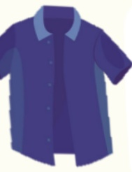

## Daily Life - Clothing

Wear comfortable, easy-to-change, and easy-to-wash clothing. Prefer front-buttoned garments, and choose clothes one size larger than your usual fit.

Clothing and pants should generally be put on while sitting.

## Undressing

Remove the side of the healthy limb first, then the affected side.

## Dressing

Put on the affected side first, then the healthy side.

Avoid shoes that require laces, to prevent slipping and tripping due to loose laces.

## :

Avoid clothing that is too tight, as it may make dressing and undressing difficult.