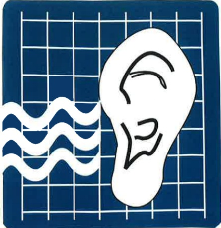

## Four. Symptoms of Increased Intracranial Pressure

Early symptoms of increased intracranial pressure may include: headache, dizziness, drowsiness, nausea, vomiting, restlessness, elevated blood pressure, elevated body temperature, dilated pupils, seizures, and changes in consciousness.

## Five. Precautions

(1) Closely monitor the condition of increased intracranial pressure.

(2) During hospitalization, rest in bed and elevate the head by approximately 30–40 degrees.

(3) Maintain a straight head and neck position; avoid pressure or twisting to prevent affecting cerebral blood circulation.

(4) Eat more high-fiber foods (such as vegetables and fruits) to prevent constipation.

(5) Maintain normal bowel function; avoid straining during defecation or blowing the nose, as this may lead to increased intracranial pressure.

(6) Maintain a calm environment and minimize environmental stimuli.

This copyright is not allowed to be reproduced, copied, or resold without the consent of the copyright holder.

Copyright Holder: Yida Medical Foundation

Form Number: HA-1-0106 (1)

Printed by Yida Medical Foundation, 20x20 cm, 2015.10; Revised in 2011.05

## Precautions for Increased Intracranial Pressure

