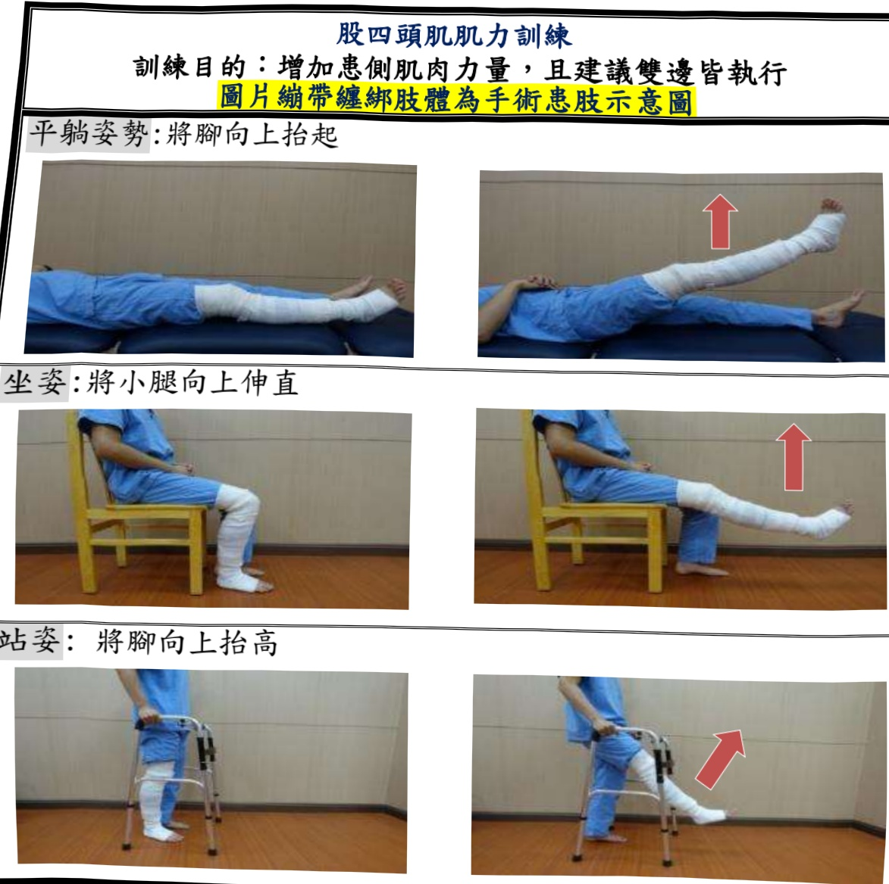

## IV. Preoperative Rehabilitation Exercise Preparation

Exercise timing: Before surgery

Exercise objectives: Maintain joint flexion angle/increase muscle strength, to facilitate smooth postoperative recovery

Exercise frequency: Hold each movement for 5 seconds, repeat 15 times per set, perform 4 sets per day.

Quadriceps muscle strength training

Training purpose: Enhance muscle strength on the affected side; it is recommended to perform bilateral exercises, with the image showing band wrapping indicating the surgical affected limb

Lying position: Lift the foot upward

Sitting position: Extend the calf upward

Standing position: Lift the foot upward