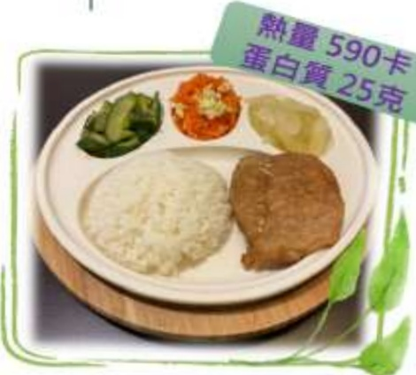

## Postoperative Dietary Reference Meal Plan

Calories: 350 kcal  
Protein: 15 g  

## 1500 kcal

| Type       | Meal Option                          |
|------------|--------------------------------------|
| Convenience Store | Salted and Scallion Braised Pork Rice Ball + Yemi Soy Milk |
| Salted and Scallion Braised Pork Rice Ball | Rice 37g (about 1/4 bowl), Braised Pork 10g |
| Yemi Soy Milk | 260ml (about 7/8 full), containing 15g sugar |

| Self-serve Meal | Meal Option                        |
|----------------|------------------------------------|
| Buffet Meal     | Spicy Braised and Preserved Pork Rice Box |
| White Rice      | 150g (3/4 bowl)                   |
| Braised Pork    | 65g (2/3 palm)                   |
| Red Sauce Fried Egg | 60g (half egg / about 1/4 bowl of red sauce) |
| Stir-fried Big Yellow Gourd | 58g (about 1/4 bowl of big yellow gourd) |
| Garlic Stir-fried Small Yellow Gourd | 55g (about 1/4 bowl of small yellow gourd) |
|                | Papaya 160g (1/3 of a fruit)     |

| Meal Package | Meal Option                     |
|-------------|---------------------------------|
| Package      | Dumpling Package               |
| Dumpling Skin, Pickled Cucumber, Cold-Pressed Water Spinach, Dry Thread with Seaweed, Nori Soup, Dumpling Filling, One Apple | 60g (3/4 bowl), Vegetables 105g (one bowl), Pork Filling 70g (one palm), 3/4 bowl (8/10 full quantity) |

Nutrition Therapy Department, Yida Medical Foundation