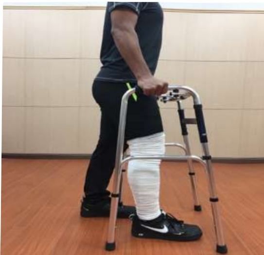

## Three. Day Two After Surgery

1. Passive knee joint range-of-motion exercises: 2 times daily, 30 minutes each session. Perform at 60 degrees.

2. Ice application: 4 times daily, 15 minutes each time.

3. Dorsiflexion exercises of the foot: 4 times daily, 15 repetitions each time.

4. Quadriceps and hamstring exercises: 4 times daily, 15 repetitions each time.

5. Getting out of bed

(1) Standing: 4 times daily, 5 minutes each time.

(2) Walking with assistive devices: 4 times daily, 5 minutes each time. Use of walker as described on page 32.

Illustration of bandaging the limb for the surgical affected limb

6. Wheelchair transfer assistance may be provided as described on page 33, depending on the situation.