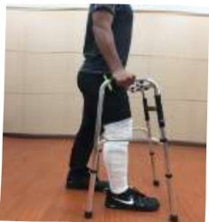

## Seven. Postoperative Day 6 and Beyond (Including Day 6)

1. Passive knee joint angle movement: 2 times per day, each session for 30 minutes. Execute at 100 degrees.

2. Ice application: 4 times per day, each session for 15 minutes.

3. Dorsiflexion of the foot: 4 times per day, each session for 15 repetitions.

4. Quadriceps and gluteal muscle exercises: 4 times per day, each session for 15 repetitions.

5. Straight leg raise exercise: 4 times per day, each session for 15 repetitions.

6. Knee flexion and extension stretching exercises: 4 times per day, each session for 15 repetitions.

7. Bed exit and assisted walking: 4 times per day, each session for 5 minutes.

Postoperative rehabilitation exercises

After completing rehabilitation exercises, remember to

your knee joint

Oh!

