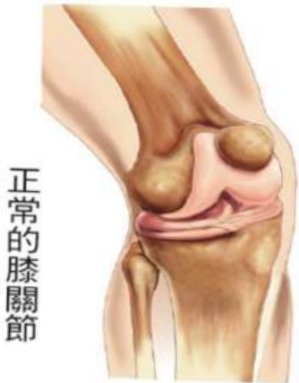

## I. Understanding Total Knee Arthroplasty

## 1. Introduction

When the knee joint degenerates, patients may experience pain, swelling, deformity, and weakness in the affected limb. In severe cases, this can lead to difficulty walking. Initial outpatient management typically involves medication and physical therapy. If pain or deformity persists despite medication and rehabilitation, and if walking becomes difficult, total knee arthroplasty may be required.

## Normal Knee Joint

Degenerated Knee Joint

## 2. Should I undergo total knee replacement surgery?

✓ Moderate exercise  
✓ Physical therapy  
✓ Oral pain relievers  

✓ Maintaining a healthy weight  
✓ Use of assistive devices  

✓ Tibial osteotomy correction  
✓ Total joint replacement  

Treatment of degenerative joint disease – shared decision-making between patient and physician  
Shared decision-making video  

✓ Hyaluronic acid injection  
✓ PRP (high-concentration platelet-rich plasma) injection  

