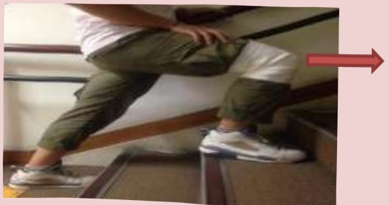

## IX. At-Home Rehabilitation Program

## I. Stretching Exercises

Objective: Gradually increase knee joint angle to 0-120 degrees

Hold for 10-20 seconds, then relax,  
Repeat 20 times,  
At least 4 sessions per day

Knee-to-chest stretch

Straight-leg raise stretch

Straight leg stretch

