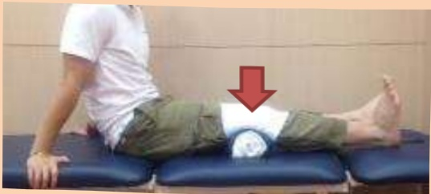

## II. Muscle-Strengthening Exercises

Hold for 10–20 seconds, then relax,  
Repeat 20 times,  
At least 4 times per day

Calf Stretch (1)

Hamstring Stretch with Towel Roll

Calf Stretch (2)

Glute Bridge Exercise

