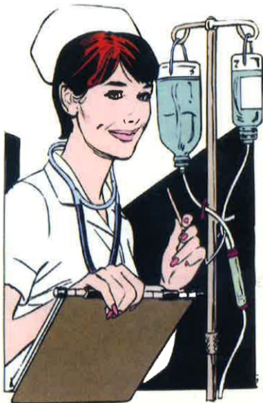

| 不符合繪住加護病房規定 | 說明 |
|------------------------|------|
| 6. 家屬要求自動出院者 | 病人或其法定代理人、配偶、親屬或關係人簽署自動出院或拒絕檢檢治療同意書。前項同意書之簽員，病人為未成年人或無法親自簽員者，得由其法定代理人、配偶、親屬或關係人簽員。注：有達反兌童及少年福利法之虞者不在此限。 |
| 7. 其他建議 | 1. 早產兒體重超過1500公克，且合併症已獲得穩定之控制。 2. 病情進入膠著狀態，預期短期無突破性進展。 3. 病情需要，需轉往其他機構或單位治療者（例如戒沫、空氣傳染疾病需負壓隔離治療或法定傳染病者）。 4. 病人或家屬拒絕接受氣切、穿刺或引流等治療。 5. 腦死不做器官捐贈者。 |

以上說明請您詳讀，欲轉病房之床等將盡量符合您的需求，若無法符合您的需求，將依病情已不符合續住加護病房規定，轉出至一般病房，再待導至您需求之床等，請您見諒。

告您有任何需要：

醫院電話：(07)6150011轉___加護病房，

我們將竭誠為您服務！！

## 義大醫院

地址：高雄市824燕巢區角宿里義大路1號

電話：07-6150011

## 義大癌治療醫院

地址：高雄市824燕巢區角宿里義大路2號

電話：07-6150022

## 義大大昌醫院

地址：高雄市807三民區大昌一路305號

電話：07-5599123

本著作權非經著作權人同意不得轉載翻印或轉售

著作權人：義大醫療財團法人

表單編號：HA-1-0132(3)

20X29.7cm 2022.05印製 2019.06修訂

## 加護病房入住須知

