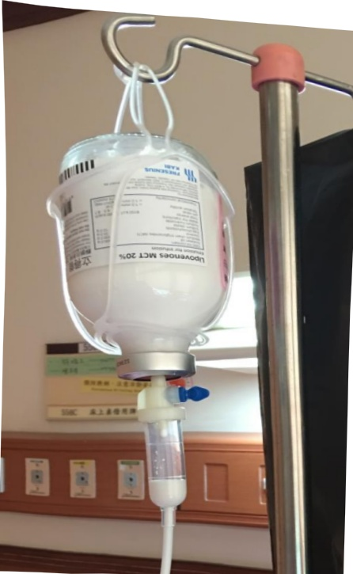

1. Remove the cap, then disinfect it with an alcohol wipe for 15 seconds, and connect using a standard connector tube.

2. Prime the infusion tube: fill the outlet of the infusion bag to 1/2 to 2/3 of the volume in the drip tube.

3. The infusion time must be at least 12 hours and no more than 24 hours.

## 【Seven. Steps for Home Peripheral Parenteral Nutrition Administration】

## (I) Steps for Baxter Nutrient Injection - Schematic Diagram

1. Open the outer membrane sleeve and confirm that the sealed bag and the partition seal are intact and undamaged.

2. Prepare the required items (peripheral venous nutrition infusion set, infusion connector tube, 10 cc syringe, normal saline, alcohol wipes).