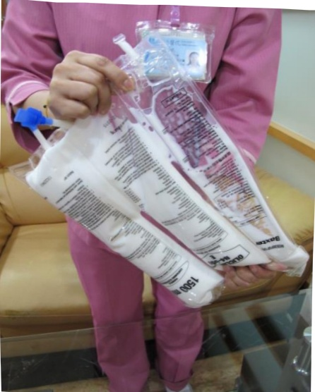

A mixed solution — grasp the upper sides of the bag and roll the soft bag forward like rolling a towel, applying force to expand the divider.

Flip the soft bag two to three times to evenly mix the solution.

Peel off the middle infusion port.