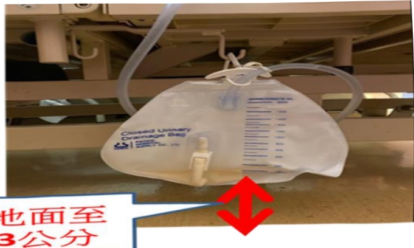

## II. Notes on Pipeline Placement

## (1) Indwelling Catheter

1. Due to postoperative activity safety, an indwelling catheter will be placed after surgery.

2. Medical staff will assess the appropriate time for removing the indwelling catheter.

3. The indwelling catheter will be secured on the inner thigh (for females) or lower abdomen (for males).

4. The urine collection bag should be placed below the bladder level; if placed above the bladder, urine backflow may occur, leading to infection. The bottom of the urine bag should be at least 3 cm above the ground to avoid contact with the floor.

## At least 3 cm above the ground

5. If there is a persistent decrease in urine output or bladder pain, please check whether the catheter has kinked, and seek assistance from medical staff.