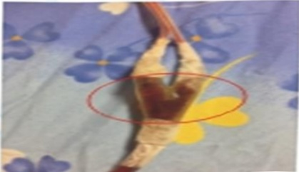

## (二) Drainage Tube

1. After surgery, a drainage tube will be placed at the surgical site of the affected limb to drain blood and prevent hematoma.

2. During the placement of the drainage tube, in addition to preventing dislodgement of the tube, the Y-shaped connector should be frequently squeezed. Ice packs should not be applied directly to the drainage tube to avoid clot formation and obstruction.

3. You should turn frequently or get out of bed to promote drainage of blood. If the drainage tube rapidly swells, it may indicate excessive blood volume or a leak in the tubing; please inform the medical or nursing staff immediately for evaluation.

4. Since the drainage tube operates under negative pressure, it can be placed directly on the bed and does not need to be hung at the bedside. However, it should be avoided from being folded. When getting out of bed, it can be secured to clothing to prevent pulling or dislodgement of the tube.

5. The time for removal of the drainage tube varies depending on individual drainage volume. If removal is required, a physician will work with a specialist nurse to assist in the procedure.