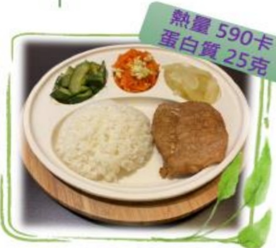

## Postoperative Dietary Reference Menus

## 1500 kcal

Calories: 350 kcal  
Protein: 15 g

| Type       | Menu                                  |
|------------|----------------------------------------|
| Convenience Store | Salted and Scallion Braised Pork Rice Ball + Yemi Soy Milk |
| Salted and Scallion Braised Pork Rice Ball | Rice 37g (about 1/4 bowl of rice), Braised Pork 10g |
| Yemi Soy Milk | 260ml (about 7/8 full), contains 15g sugar |

| Buffet       | Sautéed and Preserved Pork Rice Meal |
|--------------|----------------------------------------|
| White Rice   | 150g (3/4 bowl)                       |
| Preserved Pork | 65g (2/3 palm)                       |
| Carrot and Egg Stir-fry | 60g (half egg / 1/4 bowl of carrot) |
| Clear Stir-fried Large Cucumber | 58g (about 1/4 bowl of large cucumber) |
| Garlic Stir-fried Small Cucumber | 55g (about 1/4 bowl of small cucumber) |
| Papaya       | 160g (1/3 of a medium-sized papaya)  |

| Set Menu       | Dumpling Set                        |
|----------------|--------------------------------------|
| Dumpling Skin  | 60g (3/4 bowl)                      |
| Pickled Small Cucumber | Vegetables 105g (one bowl) |
| Cold-pressed Tofu and Kelp Salad | Dried Tofu and Kelp Salad |
| Seaweed Soup    |                                      |
| Dumpling Filling | Pork filling 70g (one palm)        |
| Apple           | 3/4 bowl (8/10 full)                |

Nutrition Therapy Team, Yida Medical Foundation