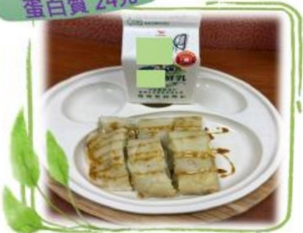

## Postoperative Dietary Reference Meal Plan

Calories: 530 kcal  
Protein: 24 g  

## 1600 kcal

| Breakfast Shop | Traditional Omelet Pancake + Fresh Milk |
|----------------|-----------------------------------------|
| Pancake        | Pancake skin 150g (3/4 bowl)           |
| Low-fat milk   | 1 egg                                  |
|                | Fresh milk 280ml                      |

| Meal Set       |                                               |
|----------------|-----------------------------------------------|
| White rice     |                                               |
| Pickled yellow cucumber |                                       |
| Cold-cured carrot strips |                                     |
| Dried silk with seaweed salad |                             |
| Nori soup       |                                               |
| Roasted meat    |                                               |
| Egg             |                                               |
| Apple 1 portion |                                               |

| Taiwanese Roasted Meat Rice Meal Set |                          |
|--------------------------------------|--------------------------|
| 150g (3/4 bowl)                     |                          |
| Vegetables total 105g (1 bowl)     |                          |
| 45g (1/3 to 2/3 palm)              |                          |
| One oil egg                        |                          |
| 120g (3/4 bowl or 8/10 full)       |                          |

Hot Feng 540 kcal  
Protein: 23.5 g  

| Meal Set | Half-tendon, half-meat beef noodle soup + Tofu |
|---------|-----------------------------------------------|
| Noodles | 340g (after water absorption), 3 servings (3/4 bowl) |
| Beef    | 60g (2/3 palm)                                |
| Bok choy | 24g (1/4 bowl)                              |
| Cold tofu salad | 90g (about 1/3 of a soft tofu box)       |
|         |  | 
|        | Kiwi 120g (1.5 pieces)                      |

Copyright © Yellow Hair Salon, Hair Treatment Department  
Prepared by the Nutrition Therapy Team, Yida Medical Foundation  

---