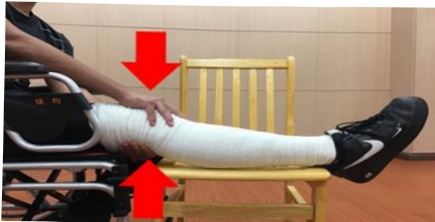

## Day 3 Post-Operatively

1. Passive knee joint range-of-motion exercises: 2 times daily, 30 minutes each session. Perform to 70 degrees.

2. Ice therapy: 4 times daily, 15 minutes each session.

3. Quadriceps and hamstring exercises: 4 times daily, 15 repetitions each.

Diagram showing the application of bandage to the surgical limb

4. Sit on the bed, extend the knee to the mid-angle and hold for 5 seconds; when bending the knee, slowly return to the original position. Aim to increase the strength of the affected limb muscles.

Diagram showing the application of bandage to the surgical limb

5. Straight leg raise exercise: 4 times daily, 15 repetitions each. Lie flat, extend the affected limb, raise it to 30 degrees and hold for 5 seconds, then slowly lower it. Aim to strengthen the muscles of the affected limb.

6. Ambulation with assistive devices: 4 times daily, 5 minutes each session. Use of walker as described on page 32.

Diagram showing the application of bandage to the surgical limb