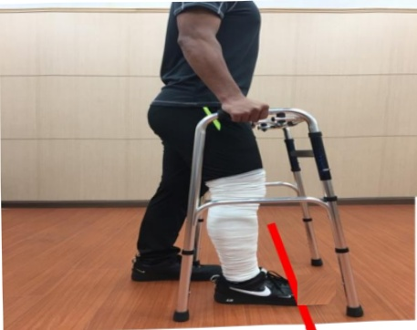

## VIII. How to Use a Walker

## Move the walker forward ↓ Step out with the affected limb first ↓ Then step in with the good foot

1. Adjust the walker height so that your elbows are slightly bent.

2. Place your body's center of gravity on the foot that hasn't undergone surgery.

Note: Keep both feet shoulder-width apart and move them in sync.

3. Move the walker forward one step at a time, maintaining an appropriate distance—do not make it too large—to prevent instability and falls.

4. Hold the walker to support your body, stepping first with the affected limb into the red zone to achieve the most stable walking posture. Reminder! Taking large steps increases the risk of falling.

5. Then step forward with the non-surgical foot, without crossing over the affected limb—this is the safest walking method.

Elbow slightly bent

20 degrees

Diagram showing bandage wrapping of the limb for the surgical affected side