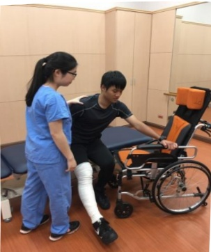

## IX. Ambulatory Activities

1. Day 1 post-surgery: Encourage the patient to remain in a semi-Fowler's position (approximately 70°–90°) as much as possible to prevent orthostatic hypotension when getting up from bed. A gradual transition from bed to standing should be followed: first elevate the head of the bed, wait for 10 minutes without any discomfort, then sit at the edge of the bed for 5–10 minutes. If no dizziness or discomfort occurs, assist the patient in standing with a walker under supervision. Only after confirming no dizziness during standing should the patient use a walker to walk within the hospital room.

2. From day 2 onwards: The patient can walk in the hospital corridor using a walker, four times per day, each session lasting 5 minutes. After activity, when returning to bed, the affected limb should be elevated and ice applied to reduce swelling.

3. The use of a walker should be maintained for at least 6–8 weeks to prevent excessive weight-bearing on the bone before it has fully healed.

## X. Wheelchair Transfer

Illustration of bandaging the limb for the surgical affected side

