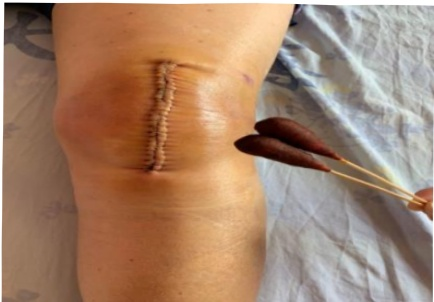

### 6. Wound Care Steps:

1. Wash hands with hand soap or soap.

2. Unwrap the gauze and examine the wound

3. Use a normal saline cotton swab to clean the wound, wiping in a circular motion from the center of the wound outward, gradually expanding to a diameter greater than 5 cm beyond the wound perimeter, avoiding back-and-forth wiping.

Hold one corner of the gauze, pull it out, align it with the center of the wound, cover the wound, and do not move it again. Secure it with adhesive tape.

4. Use a water-soluble cotton swab to disinfect the wound, wiping in a circular motion from the center of the wound outward, gradually expanding to a diameter greater than 5 cm beyond the wound perimeter, avoiding back-and-forth wiping.

6. Apply compression bandaging as instructed by the doctor, and wear compression stockings accordingly.