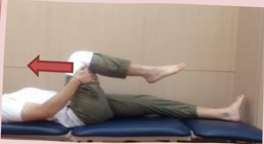
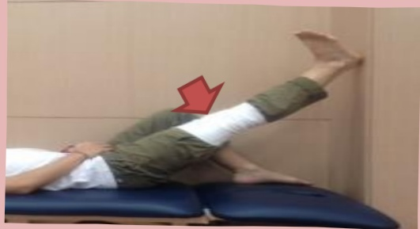
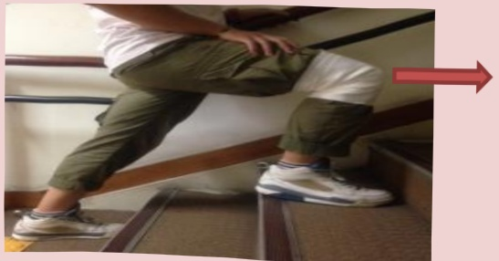

## Eleven. Home Rehabilitation Program

## 1. Stretching Exercises

Objective: Gradually increase knee joint angle to 0–120 degrees

Hold for 10–20 seconds, then relax.

Repeat 20 times.

Perform at least 4 sessions per day

Elevated Straight Leg Stretch

