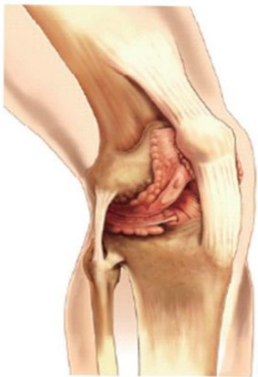

## III. Understanding Total Knee Arthroplasty

## I. Introduction

When the knee joint degenerates, it can cause pain, swelling, deformity, and weakness in the affected limb. In severe cases, this may lead to difficulty walking. Initial outpatient management typically involves medication and physical therapy. If these treatments fail to relieve pain or deformity and result in difficulty walking, total knee arthroplasty may be required.

Normal knee joint

Degenerated knee joint

## II. Should I undergo total knee replacement surgery?

✓ Moderate exercise  
✓ Physical therapy  
✓ Oral pain relievers  

✓ Maintaining ideal body weight  
✓ Use of assistive devices  
✓ Tibial osteotomy correction  

Surgery  
✓ Total joint replacement  

Patient-physician shared decision-making in treating degenerative arthritis  
Decision-making video  

✓ Hyaluronic acid injection  
✓ PRP (high-concentration platelet-rich plasma) injection  

