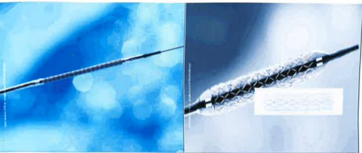

The photo shows the balloon catheter expansion process

Source: Cardiology Catheterization Laboratory, Floor 3, Tzu Chi Hospital

## (二) Stent Placement Procedure

### 1. Enlarged View of the Stent

(Left image: before expansion; Right image: stent in the vessel after expansion)

(Explanation: The stent is embedded on the balloon) Source: Cardiology Catheterization Laboratory, Floor 3, Tzu Chi Hospital

(2) Schematic Illustration of the Stent Placement Process

Source: Cardiology Catheterization Laboratory, Floor 3, Tzu Chi Hospital