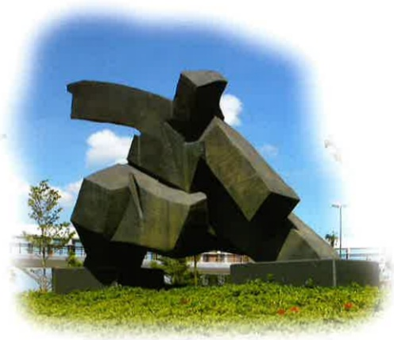

## Post-liver transplant care instructions

## 1. What is rejection?

Rejection occurs when the body's immune system recognizes foreign substances and triggers a defensive response. It is more common within the first three months after transplantation. Symptoms of rejection can often be confused with those of vascular or biliary obstruction or infection, and further differential diagnosis and treatment are usually required. Therefore, if you experience any of the following rejection symptoms, please contact the transplant team immediately:

1. Possible symptoms include:

(1) Fever (body temperature consistently above $ 38.5^{\circ} $ C).

(2) Increased heart rate.

(3) Abdominal pain (especially in the upper right abdomen).

(4) Rapid abdominal enlargement.

(5) Darkened urine (tea-colored urine), and pale stools (grayish-white stools).

(6) Jaundice.

(7) Loss of appetite.

(8) Fatigue and lethargy.

(9) Symptoms similar to a cold (such as chills, fever, abdominal pain, muscle aches, restlessness, anxiety, or significant mood swings; if family members also show cold symptoms, please inform the transplant team immediately).

2. Differential diagnosis:

(1) Blood tests.

(2) Ultrasound examination.

(3) Liver biopsy.

3. Treatment for rejection:

(1) Increase the dosage of immunosuppressive drugs.

(2) Intravenous administration of large doses of corticosteroids (Methylprednisolone).

(3) Increase the use of other immunosuppressive drugs (such as MMF).

## 2. Infection symptoms

To prevent infection, avoid contact with individuals suffering from infectious diseases such as chickenpox or measles. Maintaining a clean home environment and practicing proper health care are also essential. Below are possible infection symptoms and corresponding management measures:

## 1. Possible symptoms

(1) Cough (indicative of pulmonary infection).

(2) Fever (body temperature consistently above 38.5°C for more than 24 hours).

(3) Abnormal changes in skin wounds (such as redness, swelling, warmth, or fluid discharge).

(4) Rash (such as having been in close contact with individuals showing symptoms of measles or chickenpox, or spending over one hour in the same room as someone with a rash; exposure to someone who develops a rash within 24 hours is considered equivalent to direct contact with a person showing rash symptoms).

2. Differential diagnosis:

(1) Blood testing.

(2) Bacterial or viral culture.

(3) Arrange for X-ray examination.

3. Treatment for infection symptoms:

(1) Reduce the dosage of immunosuppressive drugs.

(2) Administer antibiotics, antiviral agents, or antiviral globulin based on the source of infection.

