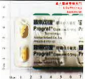
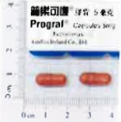

## Five. Follow-up Plan

## 1. From discharge to one month

(1) Check white blood cell count, renal function, FK506 (immunosuppressive agent) blood concentration, and blood glucose every 1–2 weeks.

(2) Liver function blood tests.

## 2. From one month to two months

(1) Check white blood cell count, renal function, FK506 (immunosuppressive agent) blood concentration, and blood glucose every 2–4 weeks.

(2) Liver function blood tests.

3. Subsequently, check once a month: the testing items will be determined by the physician's assessment. After one year post-transplant, follow-up visits will be scheduled every three months.

(1) If white blood cell count < 2000, there is a risk of infection, and the dosage of immunosuppressive medication should be adjusted.

(2) If creatinine levels rise, it indicates renal toxicity, and the dosage of immunosuppressive medication should be adjusted.

(3) If liver function markers rise, it may suggest organ rejection; diagnosis must first be confirmed before adjusting medication dosage.

4. Check cholesterol index and tumor markers every three months.

5. Test for hepatitis virus antigens and antibodies every three months; after one year, switch to annual testing.

6. Test for hepatitis virus load every six months.

7. Perform abdominal ultrasound every three months; after one year, switch to annual testing.

8. Perform a CT scan annually.

The success or failure of liver transplantation is 30% due to the efforts of the transplant team and high-quality care, and 70% depends on your cooperation with medical procedures, possessing correct home care knowledge, and having a strong family support system. If you have any questions during home care, please call the following consultation number: 615-0011 ext. 5855.

## Six. Medications Used After Transplantation

## 1. Preventing Organ Rejection

|  |  |  
|---|---|  
| **FFK-506 Short-Acting Type** |  |  
| **Prolactin 0.5 mg** | **Prolactin 1 mg** | **Prolactin 5 mg** |  
|  |  |  |  

**FK-506 Long-Acting Type**

 (40%)  
 (19%)  
 (20%)  
 (12%)  
 (13%)  
 (13%)  

Note: This medication also has anti-inflammatory effects.