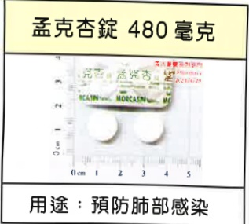
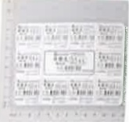
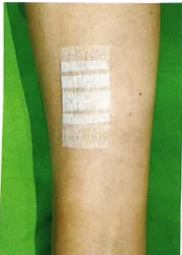

## 2. Medications for Preventing Post-Transplant Infections

<table border=1 style='margin: auto; width: max-content;'>
<tr>
<td style='text-align: center;'>Mengke Xing Tablets 480 mg </td>
<td style='text-align: center;'></td>
<td style='text-align: center;'>[l]</td>
</tr>
<tr>
<td colspan="3">Indication: Prevent lung infection</td>
</tr>
<tr>
<td style='text-align: center;'>Beileke 0.5 mg</td>
<td style='text-align: center;'>Xingdin 0.5 mg</td>
<td style='text-align: center;'>Fusiding 300 mg, Weilide 2.5 mg</td>
</tr>
<tr>
<td style='text-align: center;'></td>
<td style='text-align: center;'></td>
<td style='text-align: center;'></td>
</tr>
<tr>
<td colspan="3">Indication: Treatment of B-type hepatitis or prevention of B-type hepatitis recurrence</td>
</tr>
</table>

## 3. Other

## VII. Post-Operative Wound Care

To maintain a flat wound and reduce the risk of keloid formation, replace the wound dressing (or cosmetic adhesive) every 3 days and apply it for at least 3 to 6 months. If the wound becomes red or itchy to the point of discomfort, remove the dressing (or adhesive) first, wait until the redness and itching subside, then reapply. The dressing should be applied perpendicularly to the wound, with each piece overlapping (as shown in the diagram below). You can take a shower; after showering, simply dry the dressing (or adhesive) on the wound.

Appendix 1

<table border=1 style='margin: auto; width: max-content;'>
<tr>
<td style='text-align: center;'>High-potassium foods</td>
</tr>
<tr>
<td style='text-align: center;'>Bananas, strawberries, honeydew melon, tangerines, papaya, eggplant, tomatoes</td>
</tr>
<tr>
<td style='text-align: center;'>Potatoes, radishes, leafy greens, carrots, broccoli, cabbage, spinach</td>
</tr>
<tr>
<td style='text-align: center;'>Red mustard greens, soybean sprouts, shiitake mushrooms, green cauliflower, Chinese cabbage sprouts</td>
</tr>
<tr>
<td style='text-align: center;'>Coffee, nuts, sports drinks, chocolate, cocoa, low-sodium soy sauce</td>
</tr>
</table>