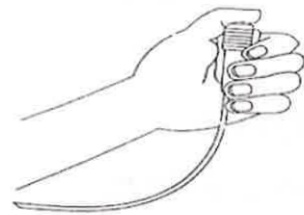

## II. Common postoperative pain relief methods

## Say "pain" boldly — refuse postoperative pain

## Common postoperative pain relief methods include the following:

**Oral medication**: For mild pain, take medication as instructed by your doctor. Even if you currently feel no pain, continue taking the medication to achieve better pain control.

## Intramuscular or intravenous injection (non-steroidal or morphine-based analgesics):

Individuals vary in their pain tolerance and drug absorption, and the duration is limited. These medications must be administered at fixed intervals as directed by your doctor, or used for sudden, acute pain.

**Multimodal analgesia**: The anesthesiologist evaluates and selects the appropriate administration method and route. Medication can be delivered via machine, intravenously, or locally, with safe dosing and locked-in timing to allow patients to choose their preferred method.

**Nerve block procedure**: Under ultrasound guidance, the exact location of the nerve is precisely identified, and local anesthetic is injected around the nerve to temporarily numb it, providing pain relief for 6–8 hours. The affected limb may experience numbness, tingling, or muscle weakness, which will resolve once the drug effect wears off.

## III. Non-pharmacological methods to alleviate pain

1. Distract yourself from pain through activities such as listening to music, playing cards, or going for a walk.  
2. Maintain a relaxed and positive mindset — for example, having companionship from family or friends can provide psychological support and help reduce your perception of pain.  
3. Position your body in the posture that feels most comfortable to you.  
4. Use religious beliefs, such as chanting or praying, to shift your focus away from pain.  
5. Ask your treating physician whether cold or hot compresses can help reduce pain.  
6. When pain becomes unbearable, inform medical staff and request adjustments to your analgesic medication.

## IV. Common questions about pain:

1. Using analgesics does not affect wound healing; in fact, pain relief helps patients get out of bed earlier, which promotes wound healing.  
2. Side effects of analgesics: such as skin itching, dizziness, nausea, and vomiting can be improved by adjusting the dosage.  
3. Self-controlled analgesia: The goal is to use the minimal effective dose of medication so that patients do not feel pain while resting in bed. However, some pain may still be felt during intense coughing or movement, but the pain will be significantly reduced.