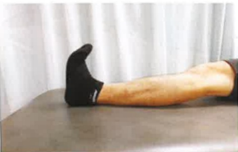

4. Duration of patient-controlled analgesia (PCA): Pain will gradually decrease 2–3 days after surgery. Oral analgesics can then be used instead, and PCA can be discontinued.

5. Differences between patient-controlled analgesia (PCA) and traditional analgesia:

(1) PCA delivers medication continuously through a machine; patients can press a button themselves when experiencing severe pain to reduce discomfort.

(2) Traditional analgesia is administered only when pain becomes unbearable; the medication starts working after 30 minutes and lasts for 4–6 hours.

6. The anesthesiologist will set the dosage and timing of PCA based on the patient's individual conditions. The dosage will be adjusted during the use period according to the patient's condition, so there is no risk of addiction or overdose.

7. The anesthesiologist will assess the patient's condition. If the patient shows signs of altered consciousness, low blood pressure, hypovolemia, or septic shock, PCA will not be administered.

8. Traditional analgesia is covered by the public health insurance; PCA is not covered and must be paid for out-of-pocket.

## Rehabilitation Exercises After Surgery

Following the rehabilitation exercises guided by a physical therapist can effectively improve functional recovery.

Video Tutorial

## One: On the Day of Surgery

1. Ice application: 4 times per day, each session for 15 minutes.

2. Foot dorsiflexion exercises: 4 times per day, 15 repetitions each. Lie flat, extend both legs, lift the sole of the foot upward for 5 seconds, then press it down for 5 seconds. This helps improve peripheral circulation and reduce swelling in the distal extremities of the operated foot.

3. Gluteal muscle exercises: 4 times per day, 15 repetitions each.

Performed in a supine position.

This helps maintain gluteal muscle strength in the operated leg, preparing the patient for standing.

4. Breathing exercises: 4 times per day, 15 repetitions each.

This helps eliminate anesthetic drugs and strengthens respiratory muscles.

5. As appropriate, gradually elevate the head of the bed, sit at the edge of the bed, or assist with wheelchair transfer (as described on page 27)

Arm abduction exercise

