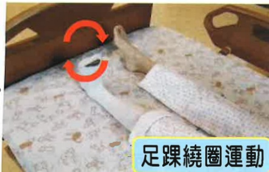

## Two. Day One After Surgery

1. Ice敷: 4 times per day, each session for 15 minutes.

2. Dorsiflexion exercise: 4 times per day, 15 repetitions each time.

3. Ankle circling exercise: 4 times per day, 15 repetitions each time.

4. Quadriceps and lateral tibial muscle exercises:

Elastic sock showing the surgical limb illustration

4 times per day, 15 repetitions each time. Place the operated foot flat on the ground, put a rolled towel at the knee area, press down on the towel, hold for 5 seconds, then release. Purpose: to enhance muscle strength.

Elastic sock showing the surgical limb illustration

Elastic sock showing the surgical limb illustration

5. Hip abduction and hip flexion exercises: 4 times per day, 15 repetitions each time. Abduct and flex the operated foot. Purpose: to improve blood circulation and joint range of motion in the operated leg.

Elastic sock showing the surgical limb illustration

Elastic sock showing the surgical limb illustration

6. Sitting at the edge of the bed: 4 times per day, each session for 5 minutes. Purpose: to gradually improve physical endurance.

7. Use of walker for walking within the hospital room, or assist with wheelchair transfer as described on page 27.

## Three. Day Two After Surgery

1. Ice敷: 4 times per day, each session for 15 minutes.

2. Dorsiflexion exercise: 4 times per day, 15 repetitions each time.

3. Ankle circling exercise: 4 times per day, 15 repetitions each time.

4. Quadriceps and lateral tibial muscle exercises: 4 times per day, 15 repetitions each time.

5. Hip abduction and hip flexion exercises: 4 times per day, 15 repetitions each time.

6. Hip flexion exercise: 4 times per day, 15 repetitions each time.

7. Hip extension exercise: 4 times per day, 15 repetitions each time.

Elastic sock showing the surgical limb illustration

Elastic sock showing the surgical limb illustration

8. Using a walker for walking: 4 times per day, each session for 5 minutes. Purpose: to improve physical endurance and lower limb muscle endurance. Walker usage as described on page 25.

9. Assist with wheelchair transfer as described on page 27.

## Four. Day Three After Surgery

1. Ice敷: 4 times per day, each session for 15 minutes.

2. Dorsiflexion exercise: 4 times per day, 15 repetitions each time.

3. Ankle circling exercise: 4 times per day, 15 repetitions each time.

4. Quadriceps and lateral tibial muscle exercises: 4 times per day, 15 repetitions each time.