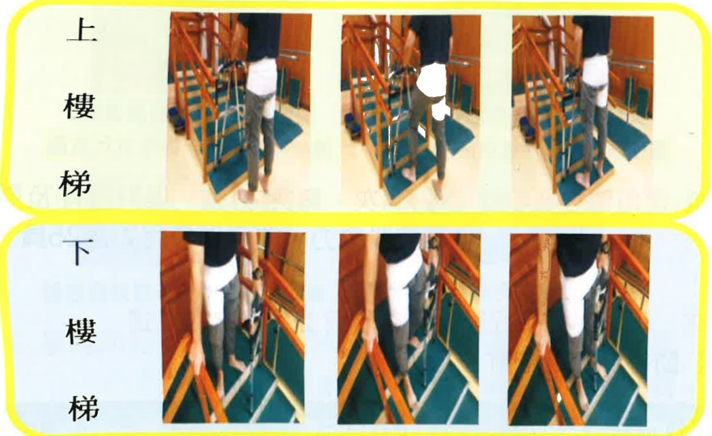
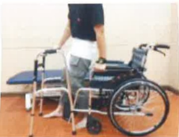

### 2. Correct Way to Go Up and Down Stairs

(1) The first 1–3 months after surgery is the period of maximum protection for the affected limb.

(2) Please follow the principle of using the healthy limb to go up the stairs and the affected limb to go down the stairs, with both feet stepping on the same step (mnemonic: "Good people use the healthy limb to go to heaven; bad people use the affected limb to go to hell").

Diagram showing the wrapping of the limb for the surgical affected side

## Seven. Walking Activities

1. On the first day after surgery: Encourage the patient to remain in a semi-sitting position (approximately 70°–90°) as much as possible to prevent postural hypotension when getting up from bed. Gradual mobilization should be adopted: first raise the bed, wait for 10 minutes without discomfort, then sit at the edge of the bed for 5–10 minutes. If no dizziness or discomfort occurs, assist the patient in standing with a walker under supervision. Only after confirming no dizziness during standing should the patient use a walker to walk within the ward.

2. From the second day after surgery onwards: The patient can walk with a walker on the hospital corridor, four times per day, each session lasting 5 minutes. After activity, the affected limb should be elevated and ice-cold compress applied to help reduce swelling.

3. The use of a walker should be maintained for at least 6–8 weeks to prevent excessive weight-bearing on the bone before it has fully healed.

## Eight. Wheelchair Transfers

Diagram showing the wrapping of the limb for the surgical affected side

1. When standing up or sitting down, the operated foot should extend forward, with the healthy leg behind.

2. When standing up, press down with both hands to lift the body upward, avoiding excessive forward leaning.

3. After standing, move both hands to the walker handles for support.

4. During transfers, ensure that the wheelchair or bed is within the range that can be reached when sitting.