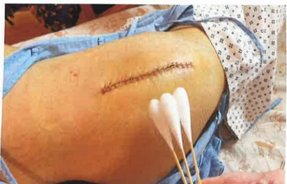
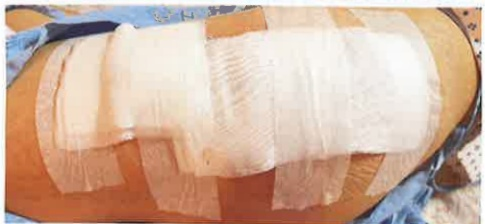

## 2. Wound Care After Returning Home

### 1. Wash hands before and after touching the wound.

2. Wound disinfection or cleaning should be performed from inside to outside, without back-and-forth wiping. The disinfection area should extend 5 cm beyond the wound margin. When changing the dressing, try to minimize the exposure of the wound to air.

3. Change the dressing once daily (it can be done after bathing). However, if the gauze becomes soaked with blood, gets accidentally wet, or falls off, the dressing must be changed immediately.

4. Keep the wound and gauze clean and dry. Avoid bathing the wound, and prefer using a wiping method instead.

5. Items needed for dressing change preparation:

(1) 20 ml normal saline solution: discard after single use

(2) 4×4 gauze

(3) sterile cotton swabs

(4) water-soluble povidone-iodine: shelf life is one week after opening.

(5) 3M paper tape: if allergic to paper tape, choose a non-allergenic adhesive tape instead)

(6) 6-inch elastic bandage (can be washed and reused).

### 6. Wound care steps:

1. Wash hands with hand soap or soap.

3. Use a normal saline cotton swab to clean the wound, wiping in a circular motion from the center of the wound outward, gradually expanding to a diameter greater than 5 cm beyond the wound perimeter, avoiding back-and-forth wiping.

5. When opening the gauze dressing, avoid touching the inner surface of the packaging. Grasp one corner of the gauze and pull it out, align it with the center of the wound, cover the wound, and do not move it again. Secure it with adhesive tape.

2. Remove the dressing and inspect the wound

4. Use a water-soluble povidone-iodine cotton swab to disinfect the wound, wiping in a circular motion from the center of the wound outward, gradually expanding to a diameter greater than 5 cm beyond the wound perimeter, avoiding back-and-forth wiping.

6. Follow the doctor's instructions for applying elastic bandages and wearing compression stockings.