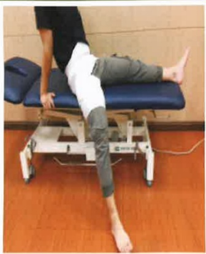

## Three. Precautions for Home Care

1. Continue performing rehabilitation exercises taught in the hospital every day after returning home.

2. Keep the wound as dry as possible. If redness, swelling, or abnormal exudate occurs, seek medical evaluation promptly.

3. Avoid friction or impact to the wound and intense physical activities (such as running or jumping). Adhere to the activity restrictions instructed by your doctor.

4. A walking aid must be used for 6 to 8 weeks post-surgery until your doctor, during follow-up visits, deems it safe to resume normal activities. Prevent falls during this period.

5. After prolonged periods of standing or getting up from bed, blood circulation in the affected limb may slow down, leading to swelling in the feet. Therefore, elevate the affected limb and apply ice to the wound after getting up to help reduce swelling.

6. The following activities must be approved by your doctor before being performed: driving, half-squatting, lifting heavy objects (over 3 kilograms), long-distance walking, or hiking.

7. When passing through security gates, the machine may alert you that you are carrying metal. You may explain the situation to the security officer or provide a hospital surgical certificate.

8. For internal or external metallic implants such as artificial joints, deep heat therapy (e.g., shortwave) is strictly prohibited, as excessive heat concentration may cause burns.

9. If you have a cold or infection in another area, or require dental treatment, inform your doctor about the presence of a prosthetic joint so that the doctor can appropriately adjust medication.

10. When can the wound be exposed to water? Only after your doctor has advised that the wound is safe to be exposed to water can you take a shower.

11. Seek immediate medical follow-up if any of the following occur:

(1) The wound has not healed after a long time, with persistent exudate, odor, or continuous bleeding.

(2) The wound shows redness, warmth around the skin, or severe pain that does not improve.

(3) A fever persists above 38.5°C.

## Ten. Home Rehabilitation

(1) Precautions: For the first three months after surgery, maintain correct daily postures and avoid hazardous movements.

Position when getting in and out of bed

Joints should not bend beyond 90 degrees

Feet should not cross each other

The operated foot should not be excessively twisted

Standing up and sitting down

Use both hands to support the handrail

Joints should not bend beyond 90 degrees

Hold the walking aid firmly while walking