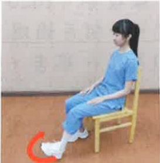

## (Four) Home Rehabilitation Exercises:

Exercise purpose: Gradually increase hip joint range of motion and strength,  
and restore daily activities as early as possible  

Exercise prescription: Maintain for 10~15 seconds. Perform 15 repetitions daily, four times a day  

## Warm-up Exercises  

  

  

  

Hip joint exercises
  

| Hip Flexion Exercise | Hip Extension Exercise | Hip Abduction Exercise |
|----------------------|------------------------|-------------------------|
|  |  |  |
| Hamstring stretch | Gastrocnemius stretch | Straight leg raise exercise |
|  |  |  |

## Gentle Exercises  

| Foot dorsiflexion exercise | Knee extension exercise |
|----------------------------|--------------------------|
|  |  |
| Assisted walking with walker (1) Move walker forward (2) Lead with the affected leg (3) Follow with the other leg |  
|  |  |

## Precautions:

(1) After returning home, it is recommended to perform home rehabilitation exercises four times a day, each session lasting about 30 minutes.  

(2) For each exercise, maintain a duration of 5~15 seconds based on the recovery status of the surgical site.  

(3) After each exercise, apply ice for 10~15 minutes, and take prescribed medications as directed by your doctor to effectively control pain in the affected leg, which will lead to better rehabilitation outcomes.  

(4) If intense pain occurs during exercise, seek medical attention immediately and receive appropriate medical treatment.  

(5) For 6~8 weeks post-surgery, use a walker to walk, to prevent falls, until your doctor during outpatient follow-up deems it safe to resume normal activities.  

(6) Within three months post-surgery, when going up stairs, lead with the unaffected leg; when going down stairs, lead with the affected leg to protect the surgical site. Refer to page 26 of the health education booklet for reference.  

Going up and down stairs carries a risk of falling; it is recommended that family members accompany the patient.