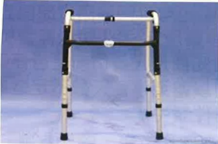
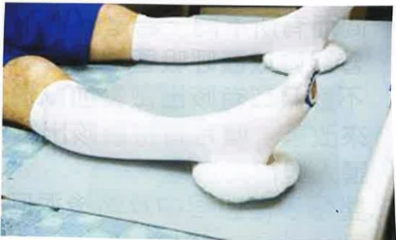

## 3. Introduction to Hospitalization Process (Applicable Hospitals: Yida Hospital)

## IV. Preoperative Preparation

## 1. Preparation of Equipment

## (1) Walker

It is recommended that patients get up and move as early as possible after surgery. Medical and nursing staff will teach patients how to use assistive devices to get out of bed.

## (2) Ice Pack

Used for icing the surgical wound post-operation to prevent swelling of the affected limb and alleviate pain.

## (3) Personal Medications

Please bring your regularly taken medications, along with the medication bottles and packaging, to the hospital on the day of admission and hand them over to the nursing staff. This will allow medical and nursing personnel to understand your medication history. If you are taking anticoagulant medications (such as anticoagulants or antiplatelet agents) or glucose-lowering medications (such as SGLT2 inhibitors), please follow the doctor's instructions to take or discontinue them, and proactively inform the medical and nursing staff.

(4) Medical Grade Compression Socks  
Worn after surgery, these socks can help prevent deep vein thrombosis in the lower limbs.

## (5) Signing of Relevant Consent Forms

✓ Surgical Consent Form  
✓ Anesthesia Consent Form  
✓ Pre-anesthesia Assessment Form  
✓ Self-paid Service Consent Form

