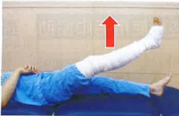
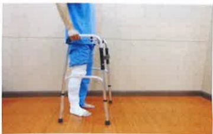

## Two. How to discontinue anticoagulant medications before surgery?

Since anticoagulant medications prolong coagulation time, if you are scheduled for total joint replacement surgery, you should proactively inform your doctor about which anticoagulant medication you are currently taking. The surgical physician will assess whether preoperative discontinuation of the medication is necessary. You may also visit your original prescribing physician to confirm whether it is acceptable to discontinue the medication and for how long. Therefore, please follow your doctor's instructions regarding anticoagulant use and proactively inform medical staff of whether you have discontinued the medication and on what date. Do not discontinue the medication on your own, as this may lead to insufficient discontinuation duration and increased bleeding risk, or prolonged discontinuation leading to thromboembolic events.

## Three. Preoperative Information

1. Blood tests, chest X-ray, electrocardiogram, and pre-anesthesia evaluation will be completed on the day of admission.

2. To prevent aspiration pneumonia during surgery due to vomiting, patients must fast for 8 hours before surgery. Medical staff will inform you of the fasting time after 9 p.m. Fasting includes all food, water, and any chewable items such as chewing gum, betel nut, or candy.

3. On the day before or on the day of surgery, patients should bathe their affected limb and body.

4. Before surgery, the surgeon will mark the surgical site. Before entering the operating room, medical staff will perform local cleaning of the surgical site and cover it with a dressing.

5. The surgery typically lasts about 4–6 hours, depending on individual anesthesia methods and recovery time. For patients undergoing general anesthesia, a breathing tube will be placed in the throat during anesthesia to assist with breathing, which may cause throat discomfort or mild blood-tinged sputum. Drinking small amounts of warm water frequently can help alleviate these symptoms. However, if fresh blood is continuously coughed up, patients should immediately inform medical staff for assistance.

6. A family member must accompany the patient throughout the entire surgical procedure and during the transfer back to the hospital room.

## Four. Preoperative Rehabilitation Exercise Preparation

Exercise timing: Before surgery  
Exercise goals: Maintain joint flexion angle and improve muscle strength to facilitate smooth postoperative recovery  
Exercise frequency: Each movement is held for 5 seconds, repeated 15 times per set, with 4 sets per day.

## Quadriceps Muscle Strength Training

Training purpose: Enhance muscle strength on the affected side; it is recommended to perform the exercise on both sides  

Image showing tape wrapping of the limb as an illustration of the surgical affected side

Lying position: Lift the leg upward

## Sitting position: Extend the calf upward

## Standing position: Lift the foot upward

