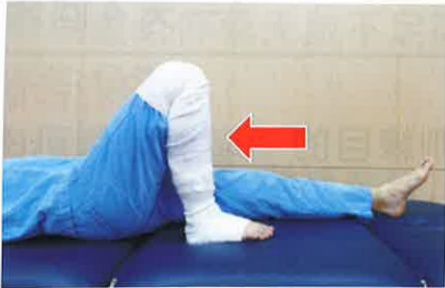

## Joint Flexion Angles

Training purpose: Improve circulation in the affected joint and maintain joint angles

Diagram showing the application of bandages on the limb for the surgical affected side

## Supine position: As much as possible, bend the thigh/leg, then slowly extend it

## Supine position with towel assistance: As much as possible, bend the thigh/leg, then slowly extend it

## Sitting position: As much as possible, bend the thigh/leg, then slowly place the foot back on the ground

## Strengthening upper arm muscle strength

Training purpose: Improve strength in both upper limbs, aiding postoperative repositioning and use of walkers

Use a fixed chair with a handrail, fully extend the elbows and lift the body, then slowly lower the body back to the chair seat

## Enhancing cardiovascular endurance

Training purpose: Improve cardiovascular endurance prior to surgery. Diagram showing the application of bandages on the limb for the surgical affected side

##  $ ^{※} $ Fixed bicycle for 10 minutes

$ ^{※} $ Bicycle height: Pedal all the way down, knees nearly fully extended

##  $ ^{※} $ Walking on a safe flat surface for 10 minutes

Physical therapist's friendly reminder: Be cautious for safety and prevent falls.  
Taiwan Medical Foundation, Rehabilitation Department, Physical Therapy Team, prepared