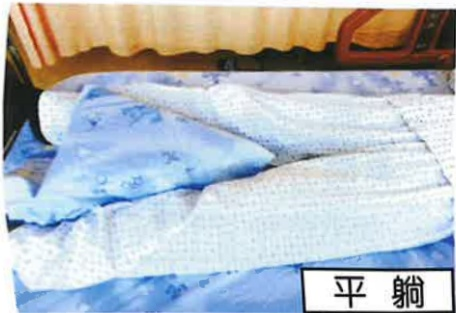

## V. Postoperative Care Guidelines

## I. Postoperative Limb Positioning and Care Instructions

1. After surgery, we will assist you in naturally extending your legs outward and place a pillow (triangular pillow) between your legs to keep your feet apart, achieving at least a 30-degree external rotation of the hip joints to prevent dislocation.

2. To prevent swelling, pain, and impaired peripheral circulation in the affected limb, a pillow can be used to elevate the surgical leg, which helps reduce edema.

Lying Flat

Lying on Side

3. Apply ice to the surgical site to reduce pain and swelling. Frequently change the ice application site to avoid impaired blood circulation. Ice application should be stopped after bedtime.

4. To prevent postoperative fever and inadequate lung expansion, patients should perform deep breathing and coughing exercises regularly. Medical staff will assist in teaching patients to turn and pat their back every 2 hours (avoiding the waist and spine). Patients should also increase fluid intake—aiming for 2000–3000 ml per day (except for patients with fluid restrictions).

5. Raise the head of the bed by approximately 30–45 degrees to facilitate eating and prevent vomiting-induced aspiration.

## II. Tube Placement Precautions

## (1) Indwelling Catheter

1. For safety during postoperative activity, an indwelling catheter will be placed after surgery.

2. Medical staff will assess the appropriate time for catheter removal.

3. The catheter will be secured on the inner thigh (in females) or lower abdomen (in males).

4. The urine collection bag must be positioned below the bladder.  
Placing it above the bladder may lead to urine reflux and infection. The bottom of the bag should be at least 3 cm above the ground to avoid contact with the floor.

5. If you notice a persistent decrease in urine output or bladder pain, check whether the catheter is kinked and seek medical staff assistance for handling.

At least 3 cm above the ground

## (2) Drain Tube

1. A drain tube will be placed at the surgical site on the affected limb to drain blood and prevent hematoma formation.

2. During the period of tube placement, in addition to preventing dislodgement, the Y-shaped connector should be frequently squeezed. Ice application should be avoided over the drain tube to prevent blood clot formation and blockage.

