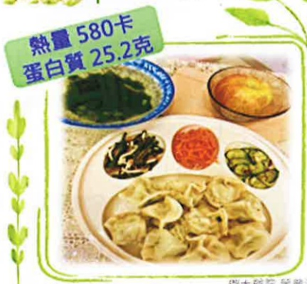

3. You should turn frequently or get out of bed to move around, to facilitate drainage of blood. If the drainage tube rapidly swells, it may indicate excessive blood volume or air leakage in the tubing; please immediately inform the medical or nursing staff for assessment.

4. Since the drainage tube operates under negative pressure suction, it can be placed directly on the bed without needing to be hung at the bedside. However, it should be avoided from being folded back. When getting out of bed, you can secure the tube to your clothing to prevent pulling on the tubing and causing dislodgement.

5. The timing for removing the drainage tube varies depending on individual drainage volume. If removal is required, a physician will work together with a specialist nurse to assist with the procedure.

## Three: Dietary Guidance

1. After returning to the ward, if there are no symptoms such as dizziness or vomiting, adopt a gradual dietary progression: first try drinking a small amount of plain water. If no vomiting occurs, you may consume liquid foods (such as fruit juice) one hour later, followed by soft, easily digestible foods (such as porridge), and by the next day, you can return to normal eating. This gradual dietary progression helps prevent digestive discomfort caused by slowed intestinal motility due to anesthesia.

2. Eat more vitamin C-rich fruits such as kiwi, cherries, and grapes, as well as high-protein foods such as chicken, duck, fish, and beef, to promote wound healing. Also consume high-fiber foods such as green vegetables to prevent constipation.

3. Remember to eat in a semi-upright or sitting position, as eating while lying down increases the risk of aspiration and subsequent aspiration pneumonia.

## Nutritional Therapy Department Provides Post-Operative Dietary Reference Menus

## Post-Operative Dietary Reference Menu (1500 kcal)

| Supermarket | Salted Scallion Braised Pork Rice Box + Yemai Soy Milk |
|------------|--------------------------------------------------------|
| Salted Scallion Braised Pork Rice | Rice 37g (about 1/4 bowl), Braised Pork 10g |
| Yemai Soy Milk | 260ml (about 7/8 full), containing 15g sugar |

| Buffet | Rice with Braised Pork and Boneless Meat Meal |
|-------|------------------------------------------------|
| White Rice | 150g (3/4 bowl) |
| Pork Bone Fragments | 65g (about 2/3 of a palm) |
| Red Lotus Taro Stir-Fried Egg | 60g (half an egg, about 1/4 bowl of Red Lotus Taro) |
| Stir-Fried Large Cucumber | 58g (about 1/4 bowl of large cucumber) |
| Steamed Small Cucumber | 55g (about 1/4 bowl of small cucumber) |
| Bason | 160g (about 1/3 of a piece) |

| Meal Set | Dumpling Meal Set |
|---------|-------------------|
| Dumplings with Pickled Cucumber, Cold Cucumber with Radish Sauce, Cold Tofu, Cold Seaweed and Nori Soup, Dumpling Syrup, Apple (1 portion) | 60g (3/4 bowl), Vegetables 105g (1 bowl), Pork filling 70g (one palm), 3/4 bowl (8/10 full) |

Da Yuan Hospital Treatment and Rehabilitation Department