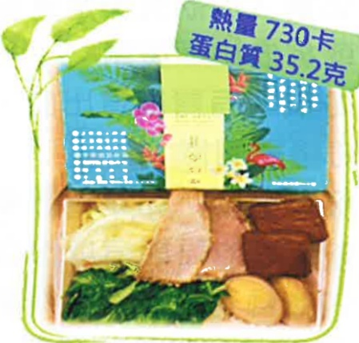

## Post-surgery dietary reference meal plan 1600 kcal

| Meal Type | Traditional pancake with fresh milk |
|----------|-------------------------------------|
| Pancake | Pancake skin 150g (3/4 bowl) |
| Egg | 1 egg |
| Low-fat fresh milk | 280ml fresh milk |

<table border=1 style='margin: auto; width: max-content;'><tr><td style='text-align: center;'>Meal Plan</td><td style='text-align: center;'>Taiwanese braised pork rice set</td></tr><tr><td style='text-align: center;'>White rice</td><td style='text-align: center;'>150g (3/4 bowl)</td></tr><tr><td style='text-align: center;'>Pickled yellow gherkin</td><td style='text-align: center;'></td></tr><tr><td style='text-align: center;'>Cold-cured carrot strips</td><td style='text-align: center;'>Smoked vegetables 105g (1 bowl)</td></tr><tr><td style='text-align: center;'>Dried silk cold-salted kelp salad</td><td style='text-align: center;'></td></tr><tr><td style='text-align: center;'>Seaweed soup</td><td style='text-align: center;'></td></tr><tr><td style='text-align: center;'>Braised pork</td><td style='text-align: center;'>45g (1/3 to 2/3 palm)</td></tr><tr><td style='text-align: center;'>Egg</td><td style='text-align: center;'>One type of wine egg</td></tr><tr><td style='text-align: center;'>Apple</td><td style='text-align: center;'>120g (3/4 bowl or 8/10 full)</td></tr></table>

| Meal Plan | Half tendon, half meat beef noodle soup + tofu |
|----------|-----------------------------------------------|
| Noodles | 340g (after absorption rate) 3 servings (3/4 bowl) |
| Beef | 60g (2/3 palm) |
| Chinese cabbage | 24g (1/4 bowl) |
| Cold tofu salad | 90g (about 1/3 of a soft tofu box) |
| Kiwi | 120g (1.5 pieces) |

Fei Dai Zhi fa fa jie ye ye

## Post-surgery dietary reference meal plan 1800 kcal

| Breakfast Shop | Cheese egg toast + Yimi soy milk |
|---------------|----------------------------------|
| Yimi soy milk | 260ml, about 7/10 full (15g sugar) |
| Two slices of bread | 100g (one bowl of rice) |
| Romaine lettuce | 10g |
| Cheese | One slice of full-fat cheese |
| Fried scrambled egg | 1 egg |

<table border=1 style='margin: auto; width: max-content;'><tr><td style='text-align: center;'>Lunch Box Shop</td><td style='text-align: center;'>Authentic lunch box</td></tr><tr><td style='text-align: center;'>White rice</td><td style='text-align: center;'>200g (one bowl)</td></tr><tr><td style='text-align: center;'>Pork slices</td><td style='text-align: center;'>50g (about 1/3 to 2/3 palm)</td></tr><tr><td style='text-align: center;'>Five-spice bean curd</td><td style='text-align: center;'>42g (about 1/3 palm)</td></tr><tr><td style='text-align: center;'>Oiled egg</td><td style='text-align: center;'>60g (one egg)</td></tr><tr><td style='text-align: center;'>Stir-fried bok choy</td><td style='text-align: center;'>80g (about 3/4 bowl)</td></tr><tr><td style='text-align: center;'>Garlic stir-fried Chinese cabbage</td><td style='text-align: center;'>75g (about 3/4 bowl)</td></tr><tr><td style='text-align: center;'></td><td style='text-align: center;'>Orange 150g (1 piece)</td></tr></table>

Maximum wall thickness and surface thickness and groove depth have

| Lunch Box Shop | Creamy garlic salted fatty chicken meat set |
|---------------|---------------------------------------------|
| White rice | 200g (one bowl) |
| Chicken meat | 70g (one palm) |
| Water egg | Half an egg |
| Garlic stir-fried Qingjiang | 50g (half bowl) |
| Vegetables with black fungus | 50g (half bowl + a little egg) |
| Carrot and egg stir-fry | Kiwi 120g (1.5 pieces) |