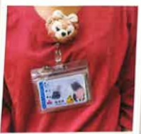

Introduce yourself proactively and wear an identification badge, which can be found on the name tag outside the ward to identify the nursing staff responsible for the three shifts.

## 03003 3A03

Day shift:
Late night shift:
Night shift:

