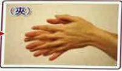
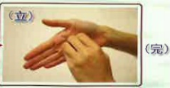

## Visiting Principles:

To ensure effective infection control, visiting times will be limited, and the number of visitors per visit will be restricted. Isolation protective measures such as wearing isolation gowns, masks, and handwashing must be strictly implemented to prevent cross-infection. Even if visits are delayed, a total of 30 minutes of visiting time will still be provided.

## Thorough handwashing to prevent infection

Foot movement—

Palms facing each other, rubbing hands together

Backs of both hands, fingers interlaced, rubbing together

Step three:

Hearts of both hands, fingers interlaced, gripping and rubbing

Step four: Fingers of both hands interlocked and rotated to rub

Step five: Thumbs of both hands, rotated to rub against each other

Step six: Palms facing each other, fingers rotated to rub

When entering the intensive care unit, please turn off your mobile phone, as patients have many tubes and devices that are susceptible to electromagnetic interference. Please also ensure that you and your family understand the purpose and importance of post-operative tubes and devices. Do not move the patient on your own, and protective restraints will be applied if necessary.

