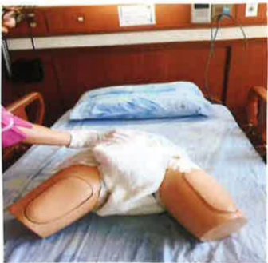

## Urinary Care:

Most surgical intensive care unit (ICU) patients require catheters due to surgical needs, the need for close monitoring of urine output, or acute urinary retention. Inappropriate catheter care can lead to infection, so the perineal area and catheter should be cleaned daily.

1. Place the commode or diaper beneath the patient's buttocks and use a water bottle to flush water.

2. Apply soap water or body wash to the patient's urethral opening, perineal area, and upper segment of the catheter, then rinse thoroughly with clean water.

3. Dry the patient's urethral opening, perineal area, and upper catheter segment with a damp wipe.

4. Assist the patient in changing to a clean diaper or clothing.

5. The urine collection bag should be positioned below the bladder, with the bag opening at least 3 cm above the ground. The opening should be kept closed at all times, and the urine in the bag should be emptied when it reaches 1/2 to 2/3 full.