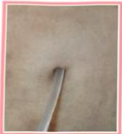

# Understanding Catheter Self-Care

## I. Catheter Exit Site Care

## (1) Importance of Catheter Exit Site Care:

Peritoneal dialysis catheters can be considered the lifeline for patients with end-stage renal disease. To prevent bacterial invasion that could compromise the integrity of the catheter exit site and lead to exit site infection, proper daily care of the catheter exit site is absolutely essential.

## (2) Catheter Exit Site Care:

1. Handwashing: Before performing catheter exit site care, thoroughly wash your hands with soap and rub until bubbles form. Then rinse them with clean, running water, and dry them with a clean paper towel before touching the catheter exit site.

2. Wearing a mask: A mask must cover both the mouth and nose. Both the caregiver and the patient should wear masks during the dressing change procedure.

3. Catheter Exit Site Care Procedure:
   (1) Check for signs of redness, swelling, heat, pain, discharge, or granulation tissue at the exit site.
   (2) Wet a cotton swab with normal saline and gently wipe the exit site in a circular motion.
   (3) Wipe the area with a dry cotton swab, then lightly clean the exit site with a small cotton swab.
   (4) Cover the top of the exit site with a Y-shaped gauze pad and a small gauze pad, securing them with paper tape.
   (5) Secure the catheter to the skin with paper tape to prevent pulling on the exit site.
   (6) Check that the titanium connector is tightly secured, then cover it with a 3×3 cm gauze pad.

$ ^{*} $ Note: For newly placed catheter exit sites or those at risk of infection, follow the doctor’s advice to apply topical ointment or povidone-iodine.

## (3) Complications:

1. Normal catheter exit site:

A healthy wound, without redness, swelling, heat, pain, or discharge

Catheter exit site

Covered with gauze

Catheter securely fixed on the abdomen to prevent pulling

2. Abnormal catheter exit site: When catheter exit sites are abnormal, failure to promptly address the issue may lead to exit site infection, which in severe cases can progress to tunnel infection. Bacteria may enter the peritoneal cavity through the infected exit site, causing peritonitis.

Red wound, suspected infection

Button sliding off and pressing on the exit site

Wound from a slipped button

Excessive granulation tissue, unstable wound

Large crust formation at the exit site