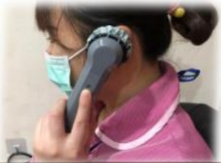
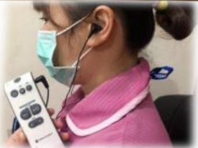

## ➢ Hearing Loss Management and Care:

1. First, visit an otolaryngology outpatient clinic to identify the cause and receive further treatment.

2. Conduct hearing tests and assessments, and wear appropriate hearing aids, which can help improve quality of life.

(Various types of hearing aids are available based on the degree of hearing loss and lifestyle, such as behind-the-ear, in-the-ear, and pocket-style models)

3. Avoid prolonged exposure to noise and reduce long-term use of earphones.

4. During conversations, speak face-to-face, avoid shouting, use a lower volume, speak slowly and clearly.

5. Do not insert objects into the ears randomly. Earwax has protective functions and can prevent ear infections. If earwax impaction occurs, seek assistance from an otolaryngologist for removal.

## When hearing abnormalities are detected, seek medical examination as soon as possible to take advantage of the opportunity to correct hearing loss.

Hearing assistance devices (sound amplification function)  
Hearing assessment

Customized digital hearing aids

➢ References:

Luo Yiqi, Ye Hui-ni, Guo Zi-yin (2021). Prevalence and related analysis of hearing loss among older adults in Taiwan. *Journal of the Taiwan Society of Geriatrics and Gerontology*, 16(2), 118–129.

Chang Dong-ren, Pei Jun (2018). Key factors affecting self-esteem among elderly due to physiological sensory degeneration. *Journal of Welfare Technology and Service Management*, 6(4), 339–352.

|  |  |  |
|---|---|---|
| **Address and Contact Information of Yida Hospital:** Yida Road, Jiaosu Village, Yancheng District, Kaohsiung City, No. 1, Phone: 07-6150011, Extension: | **Address and Contact Information of Yida Cancer Treatment Hospital:** Yida Road, Jiaosu Village, Yancheng District, Kaohsiung City, No. 21, Phone: 07-6150022, Extension: | **Address and Contact Information of Yida Dachang Hospital:** No. 305, Dachang Road, Sanyin District, Kaohsiung City, Phone: 07-5599123, Extension: |

Yida Medical Foundation, 21×29.7cm, Printed in August 2024  
Revised in May 2024, HA-1-0215(2)