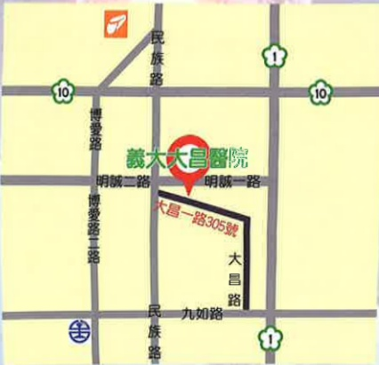

### 4. Voice hoarseness persists without improvement.

## Six. References

Chiang, F. Y. (2018). *Thyroid Surgery ABC – Guidelines for Thyroid and Parathyroid Surgery Patients (1st Edition)*. Jinming Publishing.

Liu, X. E. (2018). *Adult Internal and External Nursing (Volume II) (7th Edition)*. Huaxing Publishing.

Chen, Q. C., & Huang, L. Q. (2008). Common thyroid diseases. *Primary Medical Journal*, 23(3), 70–75. https://doi.org/10.6965/PMCFM.200803.0070

This copyright is not allowed to be reproduced, reprinted, or resold without the permission of the copyright holder.

Copyright Holder: Yida Medical Foundation

Yida Medical Foundation, 21*29.7 cm

Newly established in 2023, printed in March 2024, HA-1-0219(1)

Yida Hospital  
Address: No. 1, Yida Road, Jiaosu Village, Yancheng District, Kaohsiung City  
Phone: 07-6150011  

Yida Cancer Treatment Hospital  
Address: No. 21, Yida Road, Jiaosu Village, Yancheng District, Kaohsiung City  
Phone: 07-6150022  

Yida Da Chang Hospital  
Address: No. 305, Dachang Road, Sancheng District, Kaohsiung City  
Phone: (07)559-9123  

Thyroid Surgery  
Postoperative precautions  

