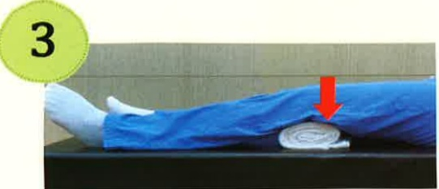
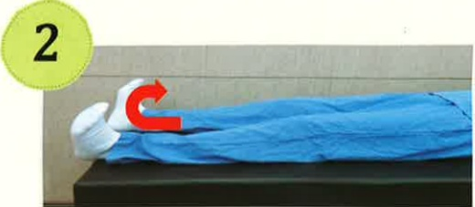
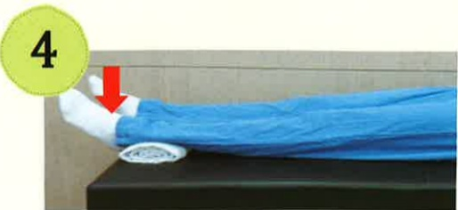

## Basic Rehabilitation Exercises

Diaphragmatic breathing exercise  
(Inhale with the abdomen slightly protruding)

Knee press on towel

Alternating knee bends and straightens

Ankle dorsiflexion

Heel press on towel

Contract abdomen, press back on towel

Contract abdomen, bend knees slightly, lift gently

Contract abdomen, straighten legs, lift upward

## Advanced Rehabilitation Exercises

Extend legs, pull and press foot sole

In-place marching (alternating thigh lifts)

Lean back against wall, perform slight squat with knees not exceeding toes

Point toes

