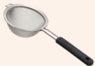

## One: Preparation of Tools

| | |
|---|---|
| Standard bowl | Standard measuring spoon |
| |  |
| Plastic spoon | Strainer |
|  |  |
| Food processor | Electric pot |
|  |  |
| Food scale | Measuring cup |

## Two: Preparation Method (First clean the tools and ingredients, then pour hot water into the food processor to cover the blades, then discard it)

### 1. Preparation for breakfast or dinner:

1) Weigh the ingredients according to portion size and add them into the food processor. Add water to a fixed volume of 250 ml (per meal) and blend until a uniform liquid consistency is achieved.

2. Preparation for four meals (breakfast + lunch + afternoon snack + dinner):

1) Weigh natural ingredients and powdered ingredients according to portion size.

2) Cut natural ingredients into small pieces and steam them together (green vegetables should be blanched separately until cooked).

3) After steaming, add 200 ml of warm boiled water to the food processor and blend until a liquid consistency is achieved.

4) Add the powdered ingredients and oil gradually into the food processor, and add water to a total volume of 1200 ml. Blend again until a uniform liquid consistency is achieved.

5) Filter out the residue using a strainer and divide the mixture into four equal portions (approximately 300 ml each). Cover and place in the refrigerator for cold storage.

### 3. Preparation of snacks or fruit juice:

1) Remove the skin (seeds) from the fruit and add 150 ml of cold boiled water (room temperature water) to the food processor. Blend until smooth and then filter.

| Meal | Ingredients | Protein 40g | Protein 50g | Protein 60g | Protein 70g |
|---|---|---|---|---|---|
| Breakfast + Dinner | Whole milk powder | 1 spoon (15g) | 2 spoons (30g) | 3 spoons (45g) | 3 spoons (45g) |
| | Brown rice flour | 4 spoons (60g) | 4 spoons (60g) | 4 spoons (60g) | 4 spoons (60g) |
| | Sugar paste | 8 teaspoons (40g) | 8 teaspoons (40g) | 4 teaspoons (20g) | 4 teaspoons (20g) |
| Breakfast + Lunch + Afternoon Snack + Dinner | Potato | 0.5 bowl (90g) | 0.5 bowl (90g) | 0.5 bowl (90g) | 0.5 bowl (90g) |
| | Egg | 1 piece (55g) | 1 piece (55g) | 1 piece (55g) | 1 piece (55g) |
| | Leafy greens | 1.5 bowl (300g) | 1.5 bowl (300g) | 1.5 bowl (300g) | 1.5 bowl (300g) |
| | Lean meat (fish meat) | - | 3 fingers wide (35g) | 1 palm (70g) | 1 palm (105g) |
| | Pumpkin | 1.5 bowl (255g) | 1.5 bowl (255g) | 1.5 bowl (255g) | 1.5 bowl (255g) |
| | Powdered sugar | 3 spoons (45g) | 2 spoons (30g) | 2 spoons (30g) | 1.5 spoons (22.5g) |
| | Plant oil | 7 teaspoons (35g) | 6 teaspoons (30g) | 5 teaspoons (25g) | 5 teaspoons (25g) |
| | Salt | 1 teaspoon (5g) | 1 teaspoon (5g) | 1 teaspoon (5g) | 1 teaspoon (5g) |
| | Yeast powder | 2 teaspoons (10g) | 2 teaspoons (10g) | 2 teaspoons (10g) | 2 teaspoons (10g) |
| | Fruit (snack) | Pomegranate juice (filtered) | 2 pieces (300g) | 2 pieces (300g) | 2 pieces (300g) | 2 pieces (300g) |