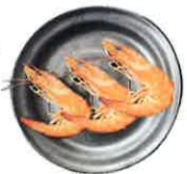
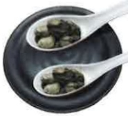

## Dietary Recommendations for Chronic Kidney Disease

## Dietary Substitution Chart and Intake Recommendations

(Calories: ___ kcal/day | Protein: ___ g/day)

| Category | Recommended Portions/Day | Food Substitution Chart |
|---------|--------------------------|--------------------------|
| Staple Foods | Morning:   bowl | Afternoon:   bowl | Evening:   bowl |
| | |  |  |  |  |
| | | 1 bowl of rice = 2 bowls of porridge | = 4 pieces of carrot cake | = 2 slices of toast |
| | |  |  |  |  |
| | | = 1 bowl of rice cake | = 2 bowls of sweet potato | = 12 pieces of rice paper | = 1 bun |
| | |  |  |  |  |
| | | = 1 bowl of rice cake | = 2 bowls of sweet potato | = 12 pieces of rice paper | = 1 bun |
| | |  |  | ※ Items marked with * have low biological value protein and are high in protein; reduce consumption. Prefer rice-based products over wheat-based products. ※ Avoid mixed grains such as millet, brown rice, oatmeal, purple rice, and millet. |
| Vegetables | ___ servings |  |  |  | 100g fresh leafy vegetables (by weight) |
| Soy, Fish, Egg, Meat | Morning:   portions | Afternoon:   portions | Evening:   portions |
| | |  |  |  |  |
| | | 1 egg = 1 cup of soy milk | = 2 tablespoons of minced meat | = 3 shrimp |
| | |  |  |  |  |
| | | = 2 pieces of small soybean tofu | = half a steamed soy bun | = 2 tablespoons of oyster | = 3 fingers of fish, chicken, or pork (size) |

Made by Mei Da Jujube Circle, 21x29.7cm, printed in 2024.06  
Revised in 2024.03, HA-3-0036(2)