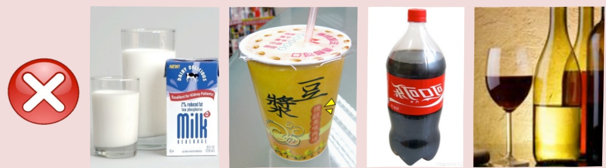

# Clear Liquid Diet - <1>

___ month ___ day,星期___ ~ ___ month ___ day,星期___

● Clear liquid diet refers to food that is completely free of residue, does not stimulate intestinal peristalsis, and is a clear liquid at room temperature.

● During hospitalization: consume approximately 30 c.c every 30 minutes to 1 hour.

After drinking liquid food, avoid lying down immediately. After discharge, try to replenish fluids as much as possible to prevent dehydration.

● For individuals with unstable blood sugar levels, please carry hard candies or sugary drinks with you to prevent hypoglycemia.

Water, sports drinks, clear fruit juices, effervescent tablets, unsweetened tea, and black coffee (based on individual circumstances)

Avoid milk, soy milk, carbonated beverages, and alcohol