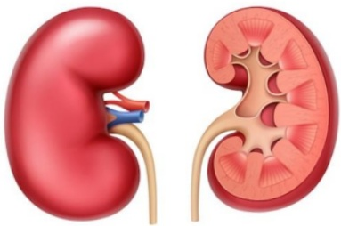

## Kidney Location

Normal humans have two kidneys located beneath the rib cage in the posterior abdominal cavity.

The kidneys have an appearance similar to broad beans, with each kidney roughly the size of a fist.

## Kidney Structure

The basic structural unit of kidney tissue is the nephron, which consists of a glomerulus and a renal tubule. Each kidney contains approximately one million nephrons.

The function of the nephron is to filter blood delivered to the kidney, removing excess water, toxins, and electrolytes, thereby forming urine.

